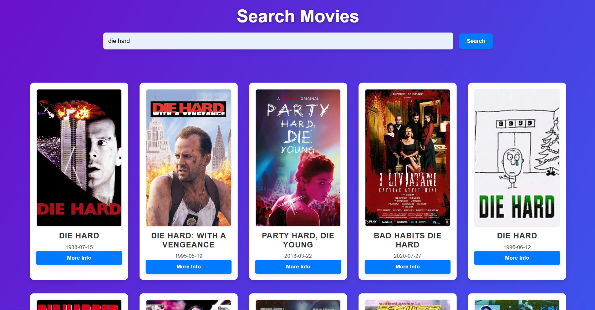

🎬 Movie Search w/ TMDB & Wikipedia APIs

A simple yet fun project where users can search for any movie title, and the app will fetch detailed information using two different APIs: [TheMovieDB (TMDB)](https://www.themoviedb.org/) and [Wikipedia](https://www.wikipedia.org/). First, it fetches movie data like release date, overview, and rating from TMDB, and then passes the movie title to the Wikipedia API to pull in a summary or article snippet.

## 🛠 Tech Stack / Frameworks Used

- **HTML/CSS/JavaScript**
- **Fetch API**
- **TheMovieDB API**
- **Wikipedia REST API**
- **Vanilla JS DOM Manipulation**

## ⚙️ How It Works

1. **User Input**: You enter a movie name into a search field.
2. **API Call #1**: The app fetches movie details from TheMovieDB.
3. **API Call #2**: It then uses the movie title to request a summary from Wikipedia.
4. **Display**: Both sets of data (from TMDB and Wikipedia) are displayed side by side in a clean layout.

## 📚 What I Learned

- How to make sequential API requests and handle asynchronous data flow.
- Improved my understanding of JavaScript’s `fetch()` and `.then()` promise chaining.
- Learned how to clean and manipulate API responses for better UX.
- Refined DOM manipulation skills without using frameworks like React or Vue.
- Gained a deeper understanding of cross-origin data fetching and error handling.

## 😊 My Experience

This project was a lot of fun and gave me a confidence boost with working directly with APIs and vanilla JavaScript. It felt rewarding to piece everything together and see real-time movie data and summaries being pulled from two completely different sources and working in sync. Debugging and structuring the flow of data between the APIs was both a challenge and a great learning moment. It definitely made me more comfortable with asynchronous JavaScript and real-world data integration.

## 📸 Screenshot

## 🚀 How to Run

1. Clone the repo:
   git clone https://github.com/yourusername/movie-search-api-project.git
